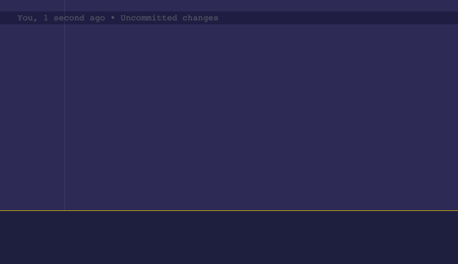

# tinder-for-go-news

It's Tinder but for Go news. An attempt to develop something small for
[Cup o' Go](cupogo.dev) and to learn [Fyne](https://fyne.io/).

## Run

```
go run main.go
```

## Demo


